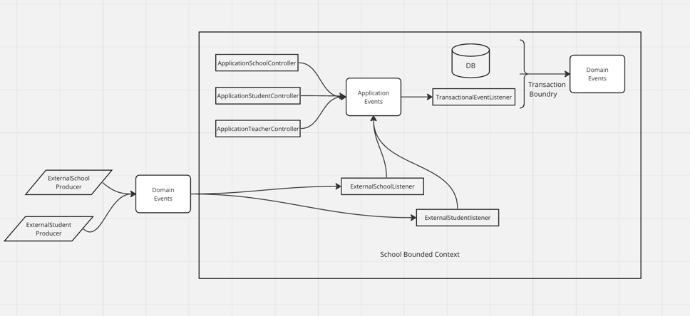

# Requirements

- Rest APIs (Done)
- Data layer with MongoDb (Done)
- Producers and consumers with kafka (Done)
- Some functional programming requirements (Did not start yet)

# What is this repo for?

My daily Kotlin playground to onboard myself, to track my progress...

# Architecture

