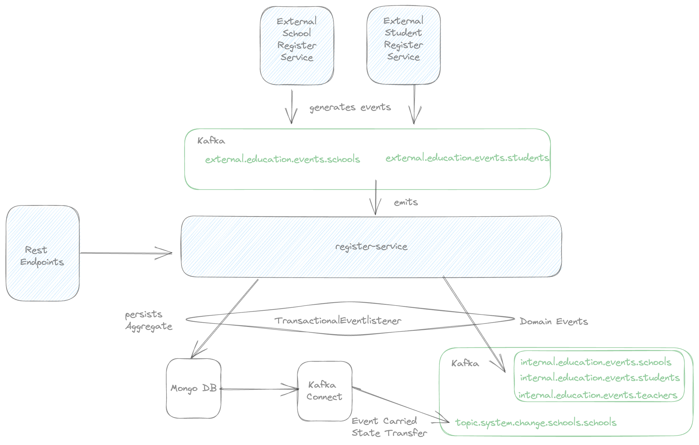

# Requirements

I will try to use some PoC's here in order to onboard myself to kotlin.

- Rest API implementation, integration testing with mockMvc
- Data layer with MongoDb, integration testing with test containers
- Producers and consumers with Kafka, integration testing with test containers
- Transactional Event listeners
- Routing implementation on Kafka, to handle different type of events on same topic
- Some DDD implementation on a very basic domain
- Kafka Streams (did not start)
- Kafka Connect implementation for ECST (done)
- Some functional programming requirements (Ongoing)


# What is this repo for?

My daily Kotlin playground to onboard myself, to track my progress...

# Architecture



# Start Environment

- Open a terminal and, inside `register-service/docker-compose` folder, run the following command
  ```
  docker-compose up -d
  ```

- Debezium uses admin user as default. In order to give access to debezium, run mongo-init.js inside of
  mongo container.
   ```
   mongosh
   use admin
   db.createUser({
   user: "admin",
   pwd: "password",
   roles: [{ role: "userAdminAnyDatabase", db: "admin" }]
   });
   ```
- Run locally the registration-service

- CURL the debezium connector
  ```
  curl -i -X POST -H "Accept:application/json" -H  "Content-Type:application/json" http://localhost:8083/connectors/ -d @debeziumConnectionConfig.json
  ```
  
- Start to send requests postman


- You can also change the poll interval and trigger external suppliers more often
  ```
  stream:
    poller:
     fixedDelay: 1000
   ```
  
- You can monitor domain events and ECTS from
   ```
   localhost:9000
   ```


